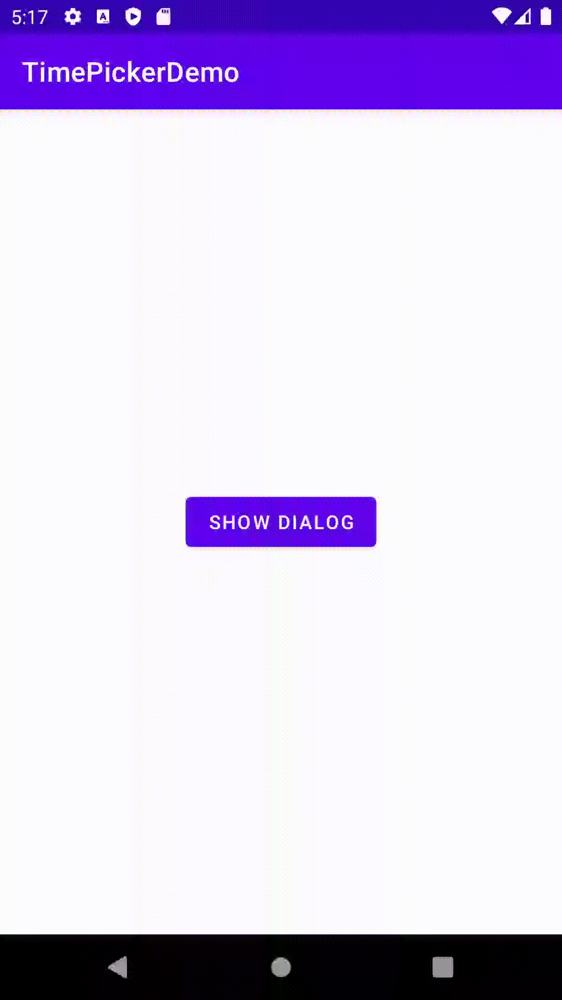

# teratail の回答用のデモアプリ

最終的には TimePicker で設定した値を MainActivity で受け取れるようにしました。



## 質問

https://teratail.com/questions/365733

## 回答

実際に動作するアプリを用意いたしましたので、こちらをご確認していただけると早いかもしれません。

https://github.com/blendthink/TimePickerDemo

ただ、これでは分かりづらいと思いますので、回答までの道筋を記載いたします。

### 回答までの道筋

※ おそらく手順2までは理解されているかと思いますが、他の方がこの質問をみたときの参考のために記載しておきます。

#### 1. 発生している例外のメッセージを読みます

```
Type mismatch: inferred type is MainActivity? but TimePickerDialog.OnTimeSetListener! was expected
↓
型の不一致: 推測された型は MainActivity? 型でしたが、TimePickerDialog.OnTimeSetListener! 型が期待されていました
```

どうやら TimePickerDialog のコンストラクタ引数に渡されている型が異なることが問題のようです。

#### 2. TimePickerDialog のコンストラクタ引数に渡しているものを確認

`TimePickerDialog(activity, activity as MainActivity?, hour, minute, true)`

現在、activity as MainActivity? を渡していますが、TimePickerDialog の第２引数には OnTimeSetListener 型の値を渡さなければなりません。

公式ドキュメント
https://developer.android.com/reference/android/app/TimePickerDialog

#### 3. どうやって OnTimeSetListener 型の値を渡すか

OnTimeSetListener は interface なので、OnTimeSetListener を実装しているクラスのインスタンスは OnTimeSetListener にキャストすることができます。
現在、TimePickerDialogFragment に OnTimeSetListener が実装されていますので、this を渡してあげると自動的に OnTimeSetListener キャストされ、いま出ているエラーは発生しなくなります。

```kotlin:TimePickerDialogFragment.kt
package com.example.alarmapp

import android.app.Activity
import android.app.Dialog
import android.app.TimePickerDialog
import android.app.TimePickerDialog.OnTimeSetListener
import android.os.Bundle
import android.util.Log
import android.widget.TimePicker
import androidx.fragment.app.DialogFragment
import java.util.*


class TimePickerDialogFragment : DialogFragment(), OnTimeSetListener {
    override fun onCreateDialog(savedInstanceState: Bundle?): Dialog {
        val c = Calendar.getInstance()
        val hour = c[Calendar.HOUR_OF_DAY]
        val minute = c[Calendar.MINUTE]
        return TimePickerDialog(activity, this, hour, minute, true)
    }

    override fun onTimeSet(view: TimePicker, hourOfDay: Int, minute: Int) {
        // ダイアログの OK を押すと設定されている値がログに表示される（onTimeSet で絞り込むと早く見つけられます）
        Log.d("onTimeSet", "hourOfDay: $hourOfDay, minute: $minute")
    }
}
```

ただ、これでは MainActivity に値を渡せていません。

#### 4. MainActivity に値を渡すためにどうするか

TimePickerDialogFragment ではなく MainActivity に OnTimeSetListener を実装するように修正します。

```kotlin:MainActivity.kt
package com.example.alarmapp

import android.app.TimePickerDialog.OnTimeSetListener
import android.os.Bundle
import android.util.Log
import android.widget.Button
import android.widget.TextView
import android.widget.TimePicker
import androidx.appcompat.app.AppCompatActivity


class MainActivity : AppCompatActivity(), OnTimeSetListener {
    override fun onCreate(savedInstanceState: Bundle?) {
        super.onCreate(savedInstanceState)
        setContentView(R.layout.activity_main)

        val button = findViewById<Button>(R.id.button_show_dialog) ?: return
        button.setOnClickListener {
            TimePickerDialogFragment().show(supportFragmentManager, TimePickerDialogFragment.TAG)
        }
    }

    override fun onTimeSet(view: TimePicker, hourOfDay: Int, minute: Int) {
        // ダイアログの OK を押すと設定されている値がログに表示される（onTimeSet で絞り込むと早く見つけられます）
        Log.d("onTimeSet", "hourOfDay: $hourOfDay, minute: $minute")
    }
}
```

```kotlin:TimePickerDialogFragment.kt
package com.example.alarmapp

import android.app.Dialog
import android.app.TimePickerDialog
import android.app.TimePickerDialog.OnTimeSetListener
import android.content.Context
import android.os.Bundle
import androidx.fragment.app.DialogFragment
import java.util.*


class TimePickerDialogFragment : DialogFragment() {

    private lateinit var listener: OnTimeSetListener

    override fun onAttach(context: Context) {
        super.onAttach(context)
        try {
            listener = context as OnTimeSetListener
        } catch (e: ClassCastException) {
            throw ClassCastException("$context must implement OnTimeSetListener")
        }
    }

    override fun onCreateDialog(savedInstanceState: Bundle?): Dialog {
        val c = Calendar.getInstance()
        val hour = c[Calendar.HOUR_OF_DAY]
        val minute = c[Calendar.MINUTE]
        return TimePickerDialog(activity, listener, hour, minute, true)
    }
}
```

## 最後に

公式のダイアログのドキュメントが丁寧に記載されているため、もしかするとより深い理解の助けになるかもしれません。

https://developer.android.com/guide/topics/ui/dialogs?hl=ja

もし不明点などあれば、いつでもご質問していただけたらと思います。
